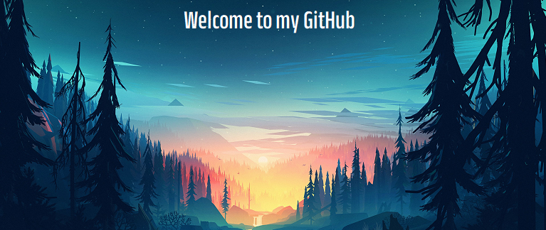

## Aqui podras encontrar en que he estado trabajando ultimamente🥇

## -

#### **#ReadyToRun**

## -

## 🚀Un poco acerca de mi:

## -

## -

### hola, para iniciar me gustaria hablar de mi epoca escolar, pues fue alli donde nacio esta aptitud, talento, amor, y otras veces odio para el desarrollo de soluciones digitales, comense como un chico al cual le emocionaba las tareas de scratch, normal... luego de un tiempo me sentia muy encerrado en este IDE y migre a Game Maker, luego de escribir codigo en este IDE dedicado a los videojuegos mi vida entera se embarcaria un nuevo rumbo... el desarrollo de sofware web, desde ahi he, aprendido un monton de cosas hasta el dia de hoy me sorprende lo mucho que se aprende en este ambito dia tras dia, al dia de hoy que redacto este escrito, me encuentro en la fase final de mi recuperacion, pues hace 4 meses tuve un accidente el cual me hizo perder la movilidad temporalmente, gracias a Dios y al apoyo de mi familia hoy nuevamente estoy en busca de un nuevo reto, un nuevo proyecto, la oportunidad de crecer personal y profesionalmente, estoy altamente familiarizado con el lenguaje TypeScript y La libreria que parece framework ReactJS con muchas de sus librerias que expanden su funcionalidad ya sea para test End to End, peticiones HTTP, animaciones, routing, style-components, interceptors, graficos estadisticos, etc, además de esto tengo conocimientos y experiencia desarrollando API´s restfull  con el motor NodeJS trabajando con Express o NestJS, ultimamente me ha llamado la atencion el diseño y la calidad de codigo es por eso que he estado estudiando Figma, CorelDraw, "Clean Arquitecture" para React, "Design Responsive", "Design Mobile First". si has llegado hasta aqui gracias por tu atencios y espero te sea util esta informacion... Buen Día
## -

## -

## te dejo mi linkedIn por si estas interesado, suerte!🍀

## [LinkedIn](https://www.linkedin.com/in/cristian-david-r-947154226/)
